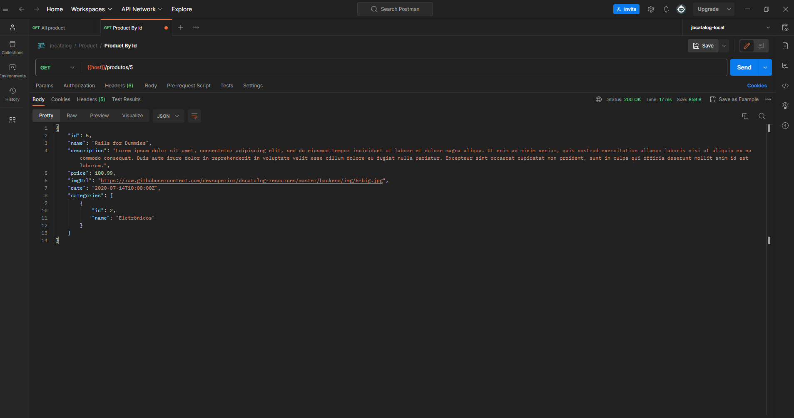
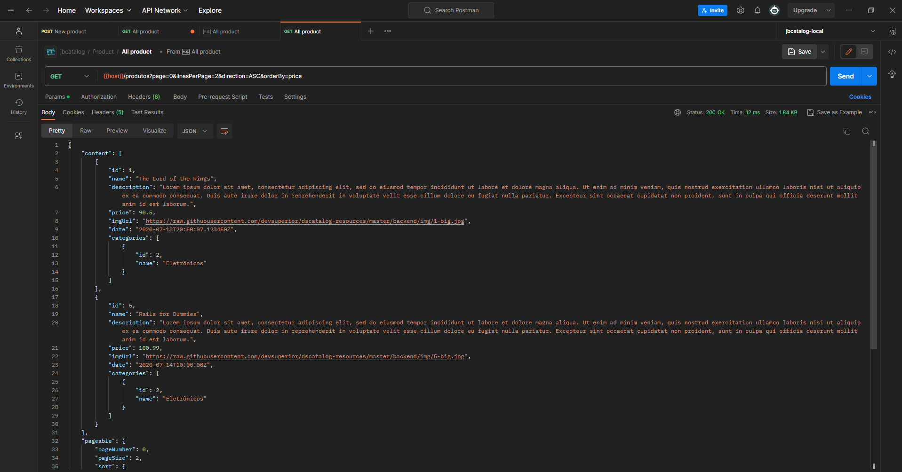
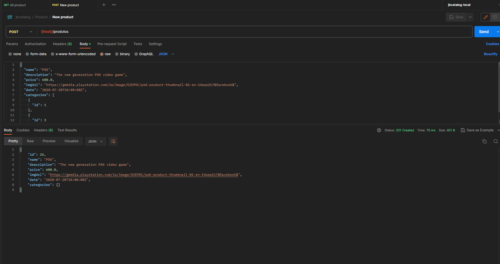
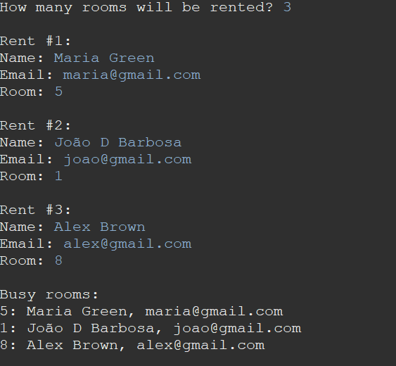

# JBCatalog - Catalogo de loja em Java ☕

## Sobre o Projeto

O JBCatalog é um sistema de catálogo de produtos, onde é possível cadastrar, visualizar, atualizar e deletar produtos e categorias. Foi desenvolvido utilizando Java com Spring Boot.

## Como Executar o Projeto

1. Clone o repositório do GitHub para sua máquina local.
2. Abra o projeto em sua IDE de preferência (como o Spring Tool Suite ou IntelliJ).
3. Configure um banco de dados compatível (como PostgreSQL) e atualize as configurações no arquivo `application.properties`.
4. Execute a aplicação.

## Endpoints Disponíveis

### Categorias

- **Listar todas as categorias (Paginado)**

  - Método: GET
  - URL: `/categorias`

- **Buscar categoria por ID**

  - Método: GET
  - URL: `/categorias/{id}`

- **Inserir nova categoria**

  - Método: POST

  - URL: `/categorias`

  - Exemplo de JSON de requisição:

    ```
    {
      "name": "Eletrônicos"
    }
    ```

- **Atualizar categoria**

  - Método: PUT

  - URL: `/categorias/{id}`

  - Exemplo de JSON de requisição:

    ```
    {
      "name": "Novo Nome"
    }
    ```

- **Deletar categoria**

  - Método: DELETE
  - URL: `/categorias/{id}`

### Produtos

- **Listar todos os produtos (Paginado)**

  - Método: GET
  - URL: `/produtos`

- **Buscar produto por ID**

  - Método: GET
  - URL: `/produtos/{id}`

- **Inserir novo produto**

  - Método: POST

  - URL: `/produtos`

  - Exemplo de JSON de requisição:

    ```
    {
      "name": "Produto X",
      "description": "Descrição do Produto X",
      "price": 100.00,
      "imgUrl": "url-da-imagem",
      "date": "2023-09-24T10:00:00Z",
      "categories": [
        {
          "id": 1
        },
        {
          "id": 2
        }
      ]
    }
    ```

- **Atualizar produto**

  - Método: PUT

  - URL: `/produtos/{id}`

  - Exemplo de JSON de requisição:

    ```
    {
      "name": "Novo Nome do Produto",
      "description": "Nova Descrição do Produto",
      "price": 120.00,
      "imgUrl": "nova-url-da-imagem",
      "date": "2023-09-25T12:00:00Z",
      "categories": [
        {
          "id": 3
        }
      ]
    }
    ```

- **Deletar produto**

  - Método: DELETE
  - URL: `/produtos/{id}`

## Testes Realizados

### 1. Listar Produtos (Página 0, 5 produtos por página)



### 2. Buscar Produtos por ID (ID: 1)



### 3. Inserir Novo Produto



### 4. Atualizar produto(ID: 26)



### 5. Deletar Categoria (ID: 2)


